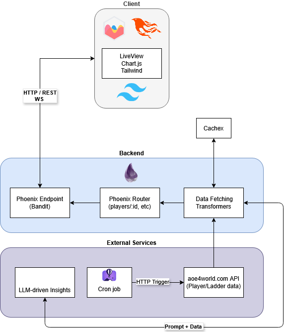

# AoE 4 Stats

_**LLM usage:** 30% (Sonnet 4.5)_

AoE 4 Stats derives new statistics from the [AoE 4 World](https://aoe4world.com) API to show more in-depth insights related to the [Age of Empires 4](https://www.ageofempires.com/games/age-of-empires-iv/) Real Time Strategy game.

## Motivation

I built this to explore Elixir and Phoenix in a way that relates to my passion for RTS games.

## Under the hood

The app is pulling data from another Age Of Empires IV API and tranforming it in ways to yield stastical data that is not available elsewhere. The player data relates to the 1v1 ladder performance in the game, the top players on the leaderboard and more generally the relationship betweens maps and civilizations. The app is hosted on Fly.io.

### Sections

#### Civilizations & Maps

- The Map Win Rate section aggregates stasistics for each map, civilization and league bracket to surface granular balance data

#### Player Statistics

- The Rating section shows 5, 10 and 20 game moving average rating information and time spent in each league
- The Analysis section uses elegant math formulas to calculate 8 different metrics that assess skill in non-traditional ways
- The Rank section shows the evolution of the player's season-end rank over season
- The Game Length section shows the player's win rates in different game length brackets which is significant due to how the game is played over time (progressing from Feudal to Castle to Imperial age)- early gameplay is more micromanagement oriented and conversely late-game is more about macro
- The Opponents section is geographical represenation of the origin of the player's opponents
- The Insights section throws the entire payload of player data at `grok-4.3` with a custom prompt to extract patterns pertaning to the player's performance.

#### Leaderboard Statistics

- Shows a breakdown of countries for Conqueror (1400+ rating), Conqueror 3 (2000+ rating) and Top 100 players
- Shows the number of Conqueror players per million for all country populations
- Shows the average rank in each country

## Prod Testing

Browse the different sections of the app to see various statistics and charts. Here are some individual player statisctics to look at:

https://www.aoe4stats.com/player/1676400/rating  
https://www.aoe4stats.com/player/60328/rating  
https://www.aoe4stats.com/player/6943917/rating

## Local Development

To start your Phoenix server:

- Run `mix setup` to install and setup dependencies
- Start Phoenix endpoint with `mix phx.server` or inside IEx with `iex -S mix phx.server`

Now you can visit [`localhost:4001`](http://localhost:4001) from your browser.
